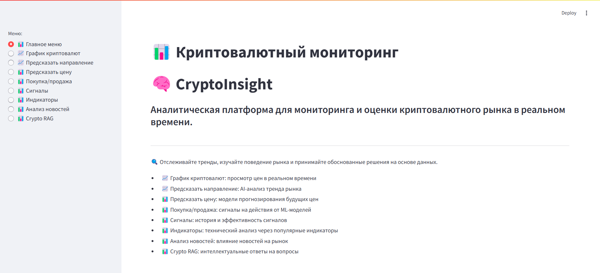

📈 Crypto Monitoring Platform

[](https://www.python.org/)
[](https://streamlit.io/)
[](https://pytest.org/)

## 🚀 Описание проекта
Crypto Monitoring Platform — это многофункциональное приложение для мониторинга криптовалют, прогнозирования цен, анализа новостей и генерации торговых сигналов в реальном времени на базе Streamlit и машинного обучения.

## 🔥 Основные возможности
📊 Графики криптовалют в реальном времени через Binance API

📈 Предсказание направлений тренда (EMA, MACD, RSI анализ)

🤖 Машинное обучение для прогноза цен (Linear Regression, Bayesian Ridge и др.)

🔥 Генерация сигналов покупки/продажи через ML-модели

📑 Анализ новостей с классификацией по криптовалюте и настроению

🧠 Crypto RAG — AI-помощник на базе Retrieval-Augmented Generation

📡 Исторические торговые сигналы из базы данных PostgreSQL

## 📂 Структура проекта
```bash
crypto-monitoring-project/
├── src/               # Основной код проекта
│   ├── main_interface.py
│   ├── settings.py
│   ├── config.py
│   ├── parsing_news/
│   └── models/
├── tests/              # Тесты pytest
├── logs/               # Логи работы приложения
├── notebooks/          # Jupyter исследования
├── data/               # Данные (если есть)
├── requirements.txt    # Зависимости проекта
├── .env.example        # Шаблон настроек окружения
├── README.md           # Описание проекта
└── .gitignore
```

## ⚙️ Установка проекта
1. Клонировать репозиторий:
```bash
git clone https://github.com//crypto-monitoring-project.git
cd crypto-monitoring-project
```

2. Создайте виртуальное окружение:

```bash
python3 -m venv venv
source venv/bin/activate  # Для Linux/Mac
venv\Scripts\activate     # Для Windows
```

## Установите зависимости:

```bash
pip install -r requirements.txt
```


## Создайте .env файл:

```bash
cp .env.example .env
```

и заполните своими токенами/ключами.

## Запустите приложение:

```bash
streamlit run src/main_interface.py
```

## 🛠️ Зависимости
- streamlit
- pandas
- numpy
- scikit-learn
- plotly
- ta
- psycopg2
- dotenv
- google-generativeai
- langchain-community
- и другие... (см. requirements.txt)

## 🧪 Тестирование проекта
Запустить все тесты можно командой:

```bash
pytest tests/
```


## 🛡️ Безопасность и приватность
Все ключи API, пароли к базе данных и другие секретные данные хранятся в .env файле.

.env добавлен в .gitignore и не попадает в репозиторий.

## 🎯 Планы на будущее

🔥 Интеграция с другими биржами (Bybit, OKX).

🔥 Улучшение производительности (асинхронные запросы к API).

🔥 Полная автоматизация торговли через сигнал-бота.

## 👨‍💻 Автор проекта
Елена Украинцева — разработчик и автор идеи проекта.

## 🎯 Быстрый старт
```bash
git clone https://github.com//crypto-monitoring-project.git
cd crypto-monitoring
pip install -r requirements.txt
cp .env.example .env
streamlit run src/main_interface.py
```

## 🖼️ Интерфейс


🎥 [Смотреть демо на Google Drive](https://drive.google.com/file/d/1bzRWahH_UkQJGCiDCwDPRJhVk71vwQ43/view?usp=sharing)